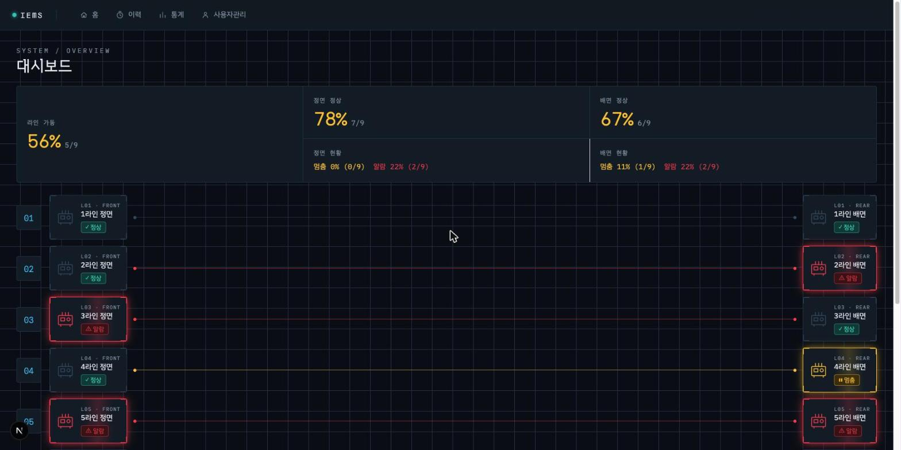

# IEMS — 검사 설비 현황 모니터링 시스템

9라인 × 2대(정면/배면) 설비의 정상/멈춤/알람 상태를 한 화면에서 색상으로 즉시 보여주고, 알람의 원인과 조치 이력을 조회·기록하는 조회 전용 모니터링 시스템입니다.

## 문서

- [PLAN.md](PLAN.md) — 프로젝트 범위·Phase·승인 지점
- [SPEC.md](SPEC.md) — 화면 흐름·데이터 구조·제약·완료 조건
- [CLAUDE.md](CLAUDE.md) — 개발 명령어·구조·규칙

## 화면 캡처

`docs/screenshots/`에서 대시보드/종합 이력/통계/사용자 관리/설비 상세/조치 보고 화면을 확인할 수 있습니다.
